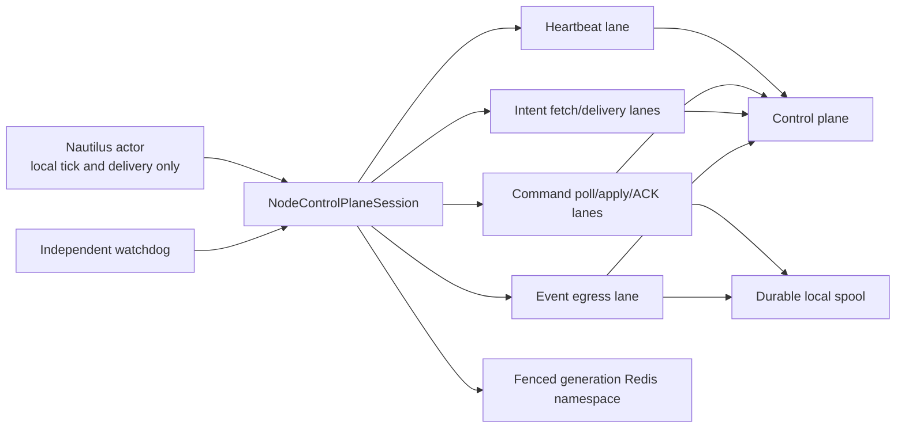

# ADR: Account Node Stall Hardening

- 状态：Proposed / review
- 日期：2026-08-08
- 决策范围：Nautilus node 控制面会话、Redis persistence、健康状态、发布与 rollout
- 事故依据：`docs/incidents/2026-08-08-account-node-stall.md`

## Context

历史生产版本曾把 heartbeat、operator command poll/ACK、approved intent poll 和部分事件
上报绑定到 Nautilus actor timer callback，同步网络调用可以占住 actor 调度线程。当前代码
已把外部 I/O offload 到专用 executor/worker；当前剩余风险集中在线程与 queue 饱和、重放
一致性、shutdown 边界和 durable continuation。Redis persistence 使用 runtime instance
identity 扩展 key space，message streams 没有 retention。生产发布依赖 bind-mounted
hotpatch，运行字节可以与宿主文件、Git commit 和同组节点分叉。

系统需要一个深模块收敛控制面复杂性：actor 只提交本地工作，网络、重试、队列、时限、
progress clock 和降级策略全部隐藏在模块实现内。调用者只依赖小而稳定的 interface。

## Decision

引入 `NodeControlPlaneSession` 模块作为 node 与 control plane 的唯一 seam。模块 interface
只暴露：

```text
start()
stop(deadline)
submit_execution_event(event) -> accepted | backpressured
snapshot() -> SessionHealth
```

heartbeat、command、ACK、intent 和 event egress 均属于模块内部实现。Nautilus actor
callback 只写入 coalescing tick token 或 bounded local queue，并在 10 ms 内返回。



### Lane Isolation

| Lane | 执行资源 | Queue | 满载策略 | 顺序与持久性 |
|---|---|---|---|---|
| heartbeat | 独立单线程 worker | capacity 1，latest-wins | 合并旧 tick，持续发送最新状态 | 不排队历史 heartbeat；记录 last_attempt/last_success |
| command poll | 独立单线程 worker | poll token capacity 1 | 合并重复 poll tick | 命令按 control-plane cursor 串行获取 |
| command apply | node actor 本地 mailbox | capacity 128 | queue 达 80% 或满载进入 degraded；暂停拉取并按容量分批 drain | 按 command sequence 串行；command_id 去重 |
| command ACK | 独立 worker + durable outbox | memory capacity 256，disk spool 有字节上限 | memory 压力进入 degraded；ACK 由 eventual ledger 保留并重试；durable spool 满载 HALT | 至少一次发送，control plane 按 command_id 幂等 |
| intent fetch | 独立单线程 worker | poll token capacity 1 | delivery queue 达 80% 时暂停拉取 | cursor 只在本地接收并持久化后推进 |
| intent delivery | node actor 本地 mailbox + durable inbox | capacity 256，disk inbox 有字节上限 | memory 压力暂停 fetch 并进入 degraded；durable inbox 满载 HALT | `RECEIVED -> PREPARED -> DISPATCHED -> EXCHANGE_CONFIRMED/REJECTED`；不确定结果先查交易所历史证据 |
| strategy durable I/O | 独立单线程 worker + actor result mailbox | task/result capacity 256 | durable task/result 容量耗尽、fsync 失败或 durable deadline 超时立即 sticky HALT | actor callback 只 enqueue；fsync 后 continuation 回 actor；management 以 durable terminal 状态收口 |
| strategy external I/O | 独立 worker + coalescing result mailbox | bounded | refresh/cancel timeout、可恢复错误与 mailbox 压力进入 degraded；继续保护、撤单和开仓 admission | refresh latest-wins；cancel 结果最终 drain |
| event egress | 独立 worker + durable spool | memory capacity 1024，disk spool 64 MiB 初始上限 | memory 满转 disk并进入 degraded；disk 达 80% degraded，满载 HALT | event_id 幂等、批量发送、ACK 后删 spool |

每条 lane 使用独立 timeout、retry budget、circuit state、metrics 和 progress timestamp。
lane 之间不共享 thread pool，不允许 heartbeat 被 intent long poll、ACK retry 或 event backlog
占用。

初始容量是明确的运维参数，必须通过压力测试校准。容量修改进入 release manifest 和 config
hash，禁止运行时静默漂移。

### Actor Durable Continuation Barrier

- `_on_intent_msg()`、`on_data()`、order/protection callback 和 management callback 只更新
  actor 内存或 enqueue bounded task。HTTP、文件锁、fsync、Redis 和 exchange refresh
  全部运行在独立 lane。
- 开仓与加仓采用 `RECEIVED -> durable PREPARE -> actor submit`。PREPARE 同时持久化
  intent dispatch、single-use canary claim 和 protection snapshot。
- PREPARE 完成回到 actor 后再次读取实时 `trading_state`。状态已进入 HALTED/REDUCING
  时拒绝 risk-increasing plan；reduce-only/cancel 路径继续可用。
- strategy 设置 stopping latch 后取消 timers、停止 worker 并丢弃 mailbox continuation。
  stopped worker 禁止被 callback 自动重启。
- durable lane 进入 sticky HALT 后，晚到 continuation 禁止触发 submit、retry、fallback
  或 management side effect；PREPARE 的 actor preimage 会恢复。
- management 在首个 replacement/cancel side effect 前持久化 `DISPATCHED` operation marker；
  terminal cancel 和最终 protection snapshot fsync 完成后持久化
  `EXCHANGE_CONFIRMED`。重启看到 `DISPATCHED` 且无法证明 terminal result 时保持
  fail-closed，禁止重复执行。

### Failure Classification

节点按一致性风险区分 soft degradation 与 hard stop。

Soft degradation 保持 `process_liveness=true`。节点处于 ACTIVE 时继续新开仓 admission、
订单管理和保护动作：

- heartbeat、command poll/ACK、intent fetch 的 HTTP timeout、5xx 和 circuit open；
- 普通 operation timeout；
- 控制面 session 与 actor handoff 内存 queue pressure/full；
- strategy external refresh/cancel 的可恢复错误和结果 mailbox 压力；
- event egress 内存 queue pressure。

Soft degradation 会记录 lane reason、暂停或合并新输入、执行 bounded retry，并在恢复后
自动清除 degraded 状态。

Hard stop 进入 sticky HALTED 或触发单次 fatal process termination：

- 显式 operator HALT；
- HTTP 409 表达的 lease、owner 或 fencing conflict；
- durable inbox/outbox/task/result queue 满载；
- durable write、fsync、原子替换或 durable operation deadline 失败；
- session 已停止后仍收到工作；
- actor tick 或 durable actor continuation 的真实 progress freeze；
- release identity、Redis writer identity 或 reconciliation 证明所有权冲突。

启动 replay 的 memory queue 满载属于 soft degradation。replay 必须分页搬运，
只有成功进入 delivery lane 后才推进 cursor；内存容量只限制单批吞吐，不能丢弃
durable receipt，也不能触发 startup fatal termination。

### Timeout And Retry

- 每次网络调用必须有 connect/read/total deadline。
- 控制面网络与 exchange refresh/cancel 的普通 operation deadline 到期后进入 soft
  degradation，打开对应 lane circuit，其他 lane 和 ACTIVE 开仓 admission 继续运行。
- durable operation deadline 与 actor progress deadline 到期后将
  `process_liveness=false`，触发单次 fatal process termination，由 orchestrator
  重启到 HALTED。
- retry 使用 bounded exponential backoff 与 jitter。
- heartbeat 始终优先发送最新状态，不回放历史 heartbeat。
- command ACK 和 execution event 使用 durable outbox；重试跨进程重启保留。
- command journal 恢复出的 pending ACK 在 session 启动后直接进入 ACK lane，
  发送成功后按 `command_id` durable 删除。
- intent fetch timeout 只影响 intent lane。intent queue backpressure 主动停止新 fetch，
  当前 ACTIVE 交易与保护动作继续运行。
- 连续 timeout 打开该 lane circuit，其他 lane 继续运行并报告精确 degraded reason。

### Watchdog And Health

增加独立于 Nautilus actor event loop 的 watchdog。watchdog 读取单调时钟上的 progress
timestamps，不执行控制面网络调用。

`SessionHealth` 至少包含：

- `process_liveness`：进程与 watchdog tick；
- `actor_tick_age_ms`：Nautilus actor 最近一次轻量 tick；
- 每条 lane 的 `last_attempt_at`、`last_success_at`、`in_flight_age_ms`、
  `queue_depth/capacity`、`circuit_state`；
- Redis ping/write、reconciliation、projection 和 exchange mirror freshness；
- release identity 与 peer consistency。

默认判定：

- actor tick age > 15 秒：readiness=false，创建 incident，进入 HALTED；
- heartbeat success age > 15 秒：control-plane readiness=false，记录 degraded；当前 ACTIVE
  交易与保护动作继续运行；
- actor tick age > 60 秒：watchdog 触发进程退出，由 orchestrator 重启到 HALTED；
- 控制面或 external exchange lane in-flight age 超过 operation deadline：degraded +
  circuit open；actor 与其他 lane 保持运行；
- durable lane in-flight age 超过 durable deadline：立即标记 process dead并触发进程退出；
- memory queue 达 80% 或满载：degraded + alert + bounded backpressure；
- durable queue/spool 满载或 durable write 失败：HALTED；
- frozen DB heartbeat payload 无论内容为何，超过 freshness threshold 都判 unavailable。

阈值必须配置化并写入 release manifest。生产初始值采用上述值，chaos test 验证后调整。

### Readiness And HALTED Semantics

状态拆成四个正交维度：

1. `process_liveness`
2. `dependency_readiness`
3. `reconciliation_health`
4. `trading_state`

语义：

- 控制面 dependency failure、普通 timeout、circuit open 和 memory queue pressure只更新
  degraded/readiness，当前 ACTIVE 交易与保护动作继续运行。
- durable queue/spool failure、watchdog stall、fencing conflict、release drift 和 Redis
  writer conflict 会将 `trading_state` 转为 sticky `HALTED`。
- soft dependency 恢复会清除 degraded/readiness 原因并保留当前 trading state；hard stop
  恢复只更新 readiness，trading state 继续 HALTED。
- `RESUME` 需要显式 operator command、有效审计身份和未过期 command/permit。常规
  `RESUME` 继续要求 release identity、owner/fence、reconciliation 与 durable state
  无硬冲突。
- restricted canary `RESUME` 只受 hard-safety incident 阻断。HTTP timeout、5xx、
  circuit open、memory queue pressure、历史 enrich 和瞬态 publication 等 soft incident
  作为 degraded warning 记录；提交开仓和精确平仓的当下路径必须可用。
- HALTED 允许 cancel、reduce、close 等风险降低动作；open/add 始终拒绝。
- watchdog 自动重启进程时，节点启动默认 HALTED，并执行 exchange-first reconciliation。
- readiness endpoint 同时返回状态值与年龄，禁止只返回布尔值。

### Redis Namespace And Retention

生产 Redis persistence 同时使用两个 identity：

```text
lease_namespace       = trader-{trader_id}
persistence_instance  = acquisition_uuid4
cache_namespace       = trader-{trader_id}:{persistence_instance}
message_bus_namespace = trader-{trader_id}:{persistence_instance}:{streams_prefix}
```

决策：

- `lease_namespace` 是执行账户的稳定互斥资源。进程 owner、release ID 与单调
  `fencing_token` 共同决定当前 owner。
- 当前 writer identity 由
  `{redis_fencing_epoch, runtime_generation, lease_fencing_token}` 构成。
  heartbeat、intent fetch/ACK、command poll/ACK 和 execution event 全部携带该 identity；
  control plane 对每次 node 请求统一校验，旧 writer 收到 409 并触发本地 fatal fence。
- 每次 acquisition attempt 由进程生成独立 UUID4 candidate；Lua 仅在成功获取 lease 时
  原子固化该 candidate，同一 attempt 的重试复用 candidate。`fencing_token` 承担当前
  Redis 历史内的顺序 fencing，UUID4 承担 counter 丢失、旧备份恢复和 Redis 替换后的
  generation 隔离。
- acquire、refresh、stale takeover 和 registry score 全部使用 Lua 内的 Redis `TIME`。
  客户端 wall clock 不参与 owner freshness 判定，时钟偏差无法触发提前抢占或未来 score。
- live cache 与 message bus 设置 `use_instance_id=True`，并将该 UUID4 同时传给
  `TradingNodeConfig.instance_id`。testnet 保持无 generation 的稳定本地配置。
- live 节点在构造 `TradingNodeConfig` 与 Nautilus `TradingNode` 前获取 namespace
  fencing lease。
  Nautilus 1.227.0 会在 `TradingNode(...)` 构造期间创建 Redis message bus/cache 并执行
  `load_cache()`；lease 获取失败会在任何 Redis cache 读写发生前终止启动，后续 assembly
  失败会释放 startup lease。
- 旧 owner 与 replacement owner 使用不同 generation。旧进程在暂停超过 lease freshness
  后恢复，只能继续写旧 generation，无法污染 replacement 的 cache 或 stream。
- lease metadata 的 `namespace` 字段记录逻辑 `lease_namespace`，并同时记录精确
  `persistence_instance_id` 与 `persistence_namespace`。refresh、remove、janitor 和发布
  证据必须验证三者一致。janitor apply 拒绝缺少任一 generation 字段的 legacy metadata；
  legacy metadata 只允许 dry-run 审计。
- lifecycle 使用单调时钟维护本地 lease freshness，初始阈值 120 秒，早于 Redis
  takeover freshness 300 秒。strategy 每次处理 intent 都读取 lifecycle trading state；
  stale process 恢复后会先 sticky HALT，再进入任何新增风险提交。
- active runtime 写入带 freshness score 的
  `trader-bot:redis-namespaces:active` registry；metadata hash 使用同 key 的
  `:leases` 后缀。
- message bus 开启 `autotrim_mins`，初始 retention 为 24 小时；同时设置每 stream
  max entries/bytes guard。
- Postgres execution events 和 durable local spool 承担审计与恢复，Redis streams 只承担
  有界实时传输。新 generation 从 exchange-first reconciliation 重建状态，旧 generation
  不承担恢复真相源职责。
- Redis 配置显式 `maxmemory`，初始目标 2 GiB，保留 `noeviction` 以维持 fail-closed；
  container memory limit 高于 Redis maxmemory，并给 OS 与其他服务保留至少 3 GiB。
- 告警阈值采用 60%/75%/85%；写失败或 85% 持续超窗触发 HALTED 和容量 incident。
- janitor 默认 dry-run。apply safety manifest 对每个执行账户同时携带稳定
  `lease_namespace` 和精确 `persistence_namespace`；前者验证当前 lease owner，后者保护
  活跃 generation。执行前创建 RDB/AOF 备份；分批 `UNLINK`；每批前重新读取 lease
  metadata；每批后验证 key count、memory 和节点 reconciliation。
- legacy random UUID 与已退休 fenced generation 只有在 replacement 完成 exchange-first
  reconciliation、满足 idle threshold 且 safety manifest 仍指向其他活跃 generation 后
  才可删除。

### Immutable Release Identity

生产节点使用不可变 image digest，应用代码、依赖 lock 和 migration manifest 全部进入镜像。
生产禁止 bind-mounted source hotpatch。配置和 secret 可以外置，配置必须生成 hash。

每个节点暴露 `/version`：

```text
git_sha
image_digest
build_id
dependency_lock_sha256
config_sha256
schema_epoch
started_at
```

release identity 同时写入 heartbeat。A/B gate 要求除 account-specific config hash 外的
identity 完全一致。`DEPLOYED_COMMIT.txt` 只保留为人类备注，不参与真实性判定。

emergency rollback 需要临时 bind mount 时：

- 只允许 inode-preserving 写入；
- 部署后立即 restart/recreate 全部相关容器；
- 检查宿主 hash、容器内 hash、mount source/destination、`//deleted`、进程启动时间；
- 节点全程保持 HALTED；
- hardening 正常 rollout 仅接受 `immutable_image` 与 control-plane isolation `require`。

### Live Risk Migration And Canary Authority

生产节点 JSON 的 `risk` 当前为空，旧容器通过
`NAUTILUS_MAX_NOTIONAL_PER_ORDER_JSON` 为 BNB/BTC/ETH/SOL 四个 instrument 配置
`100 USDT` 上限。submit/modify rate 环境变量缺失时，应用有效默认值分别为
`50/00:00:01` 和 `1/00:00:01`。

发布使用 `trader-v3-live-risk-policy/v2`：

- 同时读取 `/srv/trader-v3/node-a.hk.json`、`/srv/trader-v3/node-b.hk.json` 与两节点
  容器环境，要求所有可信来源一致。
- 将既有四个 `100 USDT` cap 和有效默认 rate 原子写入 A/B JSON，发布失败时从私有备份
  回滚两份配置。
- migration ceiling 固定为 `100 USDT`，禁止借发布扩大现有风险额度。
- recreate 计划移除旧风险环境变量，运行时只读取 release-bound JSON。

Nautilus 1.227.0 `RiskEngine` 对 margin account 的 order submission 会在
`max_notional_per_order` 检查前返回。Binance futures canary 的权威额度由控制面单次 permit、
data client permit 校验、strategy 实际名义金额校验、deterministic client order ID 和 durable
single-use store 共同执行。Nautilus risk config 保留为现有策略迁移与额外防线，不承担
canary `12 USDT` 硬上限的授权职责。

permit downlink 包含绝对 `expires_at`，control plane、data client 和 strategy 均使用
可信 UTC 时钟校验。canary 持仓建立后，独立风险 worker 持续读取新鲜 mark price，
按实际 filled quantity、fees 和 realized/unrealized PnL 计算累计净亏损。达到
`1.5 USDT` 或 mark stale 时立即 HALT，并按交易所确认数量执行精确 reduce-only close。
该监控不依赖后续 fill callback。

### Canary Completion And Evidence Recovery

canary 执行结果拆成两个独立模块：

```text
SafetyClosure
  input: exchange position/orders, HALT acknowledgement, side-effect identity
  output: closed | recoverable | exposed

FinancialEnrichment
  input: durable fills, exchange order history, rebuildable projections
  output: complete | degraded
```

`SafetyClosure` 决定是否允许 ledger 终结。只有目标仓位归零、普通订单归零、algo
订单归零、节点 HALTED、identity 一致且 close effect 没有超过授权量时返回 `closed`。
任一目标风险残留返回 `exposed` 并保持硬阻断。

`FinancialEnrichment` 决定结果是 `PASSED` 还是 `DEGRADED`。证据优先级固定为：

1. 新鲜交易所目标仓位和订单快照。
2. 同 client order ID、trade ID 和 symbol 的 durable `OrderFilled` 集合。
3. 交易所 recent order history。
4. 可重建的 `orders_projection`。
5. 节点健康与控制面 telemetry。

较弱来源的缺失或延迟不能覆盖较强来源已经确认的事实。fill reducer 对成交数量、成交价、
commission 和 trade identity 单调聚合；同 trade ID 内容冲突、跨腿 trade ID 重复、
数量不守恒继续返回 degraded 或 hard conflict。

CLOSE 调用进入未知结果后先查询交易所目标仓位。仓位已归零时停止 CLOSE 重放，并由最终
snapshot 证明 `SafetyClosure=closed`；仓位仍存在时只允许相同 side-effect ID、client
order ID 和首次 quantity 的有界幂等重放。

consumed permit 的恢复分成两类：

- Risk recovery：存在目标风险或 pending side effect，可以执行 HALT、cancel 和 capped
  reduce-only close。
- Evidence recovery：ledger 已 HALTED、pending action 为空且最终目标风险归零，只允许
  读取历史和提交 evidence，禁止 RESUME、OPEN 和 CLOSE。

Evidence recovery 使用同 permit、authorization hash、release、intent 和 open/close
identity，并要求 reviewer 独立签名的 `evidence-recovery-gate`。该 gate 绑定当前
recovery executor/adapter SHA-256、固定 permit ledger、固定 evidence path 和唯一
capability `final-snapshot-and-publish-evidence/v1`；允许动作精确为
`final-snapshot`、`publish-evidence`。

首次终结的 journal 状态转换为 `HALTED -> EVIDENCE_COMMITTED`。证据发布前 journal
状态保持 `HALTED`；`EVIDENCE_PREPARED` 只作为 history event，prepared disposition
由 `state=HALTED`、`pending_action=PUBLISH_EVIDENCE` 和包含 path、SHA-256、payload 的
`pending_evidence` 共同表示。文件原子发布并校验成功后，journal 清空 pending 字段并进入
`EVIDENCE_COMMITTED`。已提交 `DEGRADED` evidence 且标记
`financial_enrichment_retryable=true` 时，后续只读恢复使用
`EVIDENCE_COMMITTED -> EVIDENCE_ENRICHMENT_PENDING -> EVIDENCE_COMMITTED` 两阶段替换。
任一 crash window 都从 ledger 保留的 payload、旧 hash 和新 hash 继续，禁止再次调用
OPEN、CLOSE 或 HALT。

Evidence recovery 的最终交易所快照发现残余目标仓位、普通订单或 algo 订单时，ledger
原子进入 `RISK_RECOVERY_REQUIRED`。后续 evidence-only 调用在启动 adapter 前停止；风险
处置需要独立授权。

permit 和交易 gate 的过期时间继续约束新增风险。显式 `--recover-evidence-only` 模式可在
签名文档过期后验证原始签名和 ledger identity，并只处理以下 ledger disposition：
无 prepared evidence 的 `HALTED`、`HALTED + pending_action=PUBLISH_EVIDENCE` prepared
disposition、`EVIDENCE_ENRICHMENT_PENDING` 或 `EVIDENCE_COMMITTED`。
`EVIDENCE_PREPARED` history event 用于标记 prepared disposition 的形成。recovery gate
使用 `issued_at` 和软 `refresh_after`，刷新超期只记录 warning，避免审计补全再次成为
停摆源。任一不符合条件的 journal 状态或 disposition 直接返回 `BLOCKED`，不进入 HALT、
cancel、close 或 open orchestration。

### Rollout Gates

1. **Build gate**：单元、集成、Redis 重启恢复、queue overflow、timeout、stale heartbeat、
   sticky HALTED 和 release identity 测试 PASS。
2. **Fault gate**：分别注入 control-plane latency、intent timeout、ACK failure、Redis
   latency/write failure、actor freeze、process restart；验证 lane 隔离和 watchdog。
3. **Capacity gate**：连续 replacement 产生互相隔离的 generation；janitor 使 retired
   generation 数量与 key count 收敛；24 小时 streams 收敛；Redis 在目标上限内。
4. **Pre-deploy gate**：整个 Redis、Postgres migration、control-plane isolation、
   rollout 和 permit 流程持有同一个非阻塞 operation lock；备份 Redis/Postgres/manifest；
   `pg_dump` 使用 deadline、SHA256 和 restore/list validation；审计 HALT 两节点。无法 ACK
   的冻结节点执行 fail-closed stop。
5. **Canary gate**：先发布 `account-a`，启动保持 HALTED；验证 `/version`、无 deleted inode、
   heartbeat/tick、exchange-first reconciliation、orders/positions 对齐。
6. **Stability gate**：使用事件型新鲜度门替代固定 30 分钟等待。account-a 连续 30 个
   2 秒采样满足 actor progress、exchange mirror、reconciliation 和 owner identity
   新鲜即可进入 restricted canary；期间 soft degradation 记入证据并允许自动恢复。
7. **Emergency-close gate**：同 release、同 order shape 的 emergency reduce-only close
   路径完成测试网验证，证据绑定 release ID、symbol、position side 和实际 filled quantity。
8. **Account-a canary authority gate**：rollout phase 为 `account_a_canary` 时，
   仅 `account-a`、单个 fresh writer、有效 single-use permit、测试网 emergency-close
   证据和完整健康矩阵可以获得受限 RESUME。常规 RESUME 继续要求 `fleet_complete`。
9. **Live gate**：由审计执行器机械化
   `permit -> restricted RESUME -> intent -> exact close -> HALT -> evidence`，并按
   `docs/agent-team/account-stall-hardening-live-trade-policy.md` 完成单次小额 round trip，
   开仓使用显式 quantity/price 的 `LIMIT + IOC`，精确 reduce-only 平仓并确认目标 symbol
   flat、目标普通/algo orders 为零、非目标 `portfolio_baseline_sha256` 不变。执行器在机器
   层硬绑定 `account-a`、`SOLUSDT`、`12 USDT` 和累计净亏损 `< 1.5 USDT`。
10. **Fleet gate**：canary PASS 后发布 `account-b`，成功后 rollout phase 进入
    `fleet_complete`；再次检查 A/B release identity、
   account-a 目标 symbol 安全状态、签名的非目标组合基线和健康矩阵。
11. **Cleanup gate**：fenced generation 运行验证完成后，执行 legacy 与 retired
    generation janitor。
12. **Close gate**：两节点回到期望 trading state，证据包包含 version、metrics、commands、
    reconciliation、trade、目标 symbol flat/zero-orders、非目标组合基线和 rollback 验证。

hard gate 失败会保持 HALTED，并执行上一不可变 image digest 的 rollback。soft gate
失败会保持当前 trading state，标记 degraded，并在恢复后自动清除；restricted canary
在开仓与平仓所需路径当前可用时可以继续。

## Consequences

- actor event loop 不再承载外部网络等待，单个 endpoint timeout 只降级对应 lane。
- heartbeat、command 和 intent 拥有独立可观测进度，冻结 payload 无法伪装健康。
- bounded memory queues 将无限等待转换为可检测的 soft backpressure；durable
  queue/spool 容量耗尽转换为明确的 sticky HALTED。
- fenced generation 消除 stale owner 的共享写入窗口；retention、janitor 和容量门让
  generation 生命周期与 Redis 容量保持有界。
- immutable release identity 消除“同镜像标签、不同运行字节”的状态。
- 模块增加 worker、spool、watchdog 和 metrics 实现成本；复杂性集中在一个可测试 seam，
  节点调用侧 interface 保持小。

## Rejected Alternatives

### 继续提高 HTTP timeout

更长 timeout 会延长 actor callback 占用时间，无法隔离 heartbeat、command 和 intent。

### 共享线程池处理全部控制面任务

共享 pool 在 intent long poll、event backlog 或 ACK storm 下仍会耗尽，heartbeat 缺少资源保留。

### 只清理 Redis

清理能恢复容量，runtime UUID namespace 与无 retention 会再次增长；同步 actor I/O 仍会在下次
网络抖动中冻结。

### readiness 恢复后自动 ACTIVE

自动 ACTIVE 会绕过事故确认、exchange reconciliation 和 release identity gate。sticky HALTED
提供可审计恢复点。

### 继续以 bind-mounted hotpatch 作为常态发布

bind mount 的 inode 与容器生命周期允许宿主文件、运行字节和 A/B 节点分叉，无法形成可靠
release identity。

## Implementation Order

1. `NodeControlPlaneSession` lane 隔离与 bounded queues。
2. watchdog、health schema、sticky HALTED tests。
3. fenced Redis generation、retention、capacity limit、dry-run janitor。
4. immutable image 与 `/version`，A/B release gate。
5. Redis/Nautilus integration 与 fault matrix。
6. HALTED canary、真实小额交易、fleet rollout、legacy namespace cleanup。
