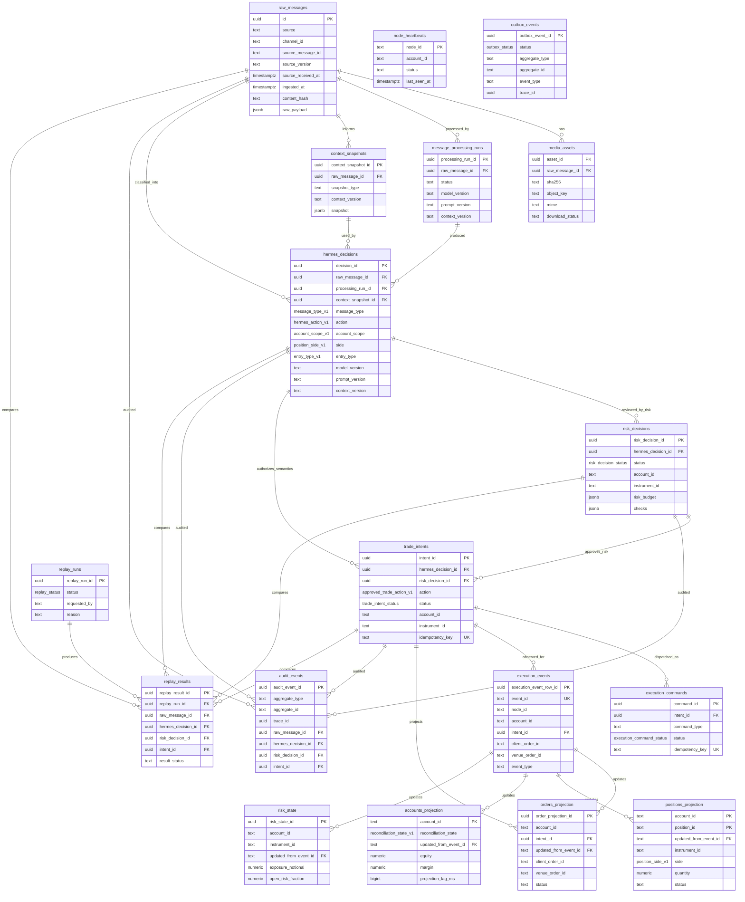

# Window A Canonical PostgreSQL ERD

PostgreSQL is the control-plane query and audit source of truth. Raw source ingest, Hermes semantic judgments, risk approvals, and approved trade intents are separate tables with FK traceability through the full chain.

Execution projection write policy:

- `execution_events`, `orders_projection`, `positions_projection`, and `accounts_projection` are writable only by the separate `nautilus_projection_writer` DB role.
- That role receives `INSERT, UPDATE` only. It is intentionally not granted `SELECT` and has no grants on ingest, semantic, risk, intent, audit, or outbox tables.
