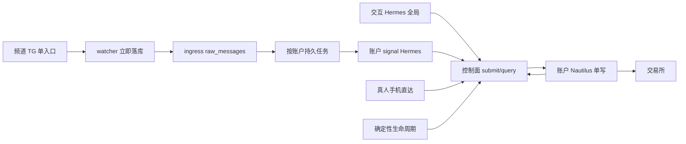

# 交易稳定性根因修复、剪枝与重构方案

日期：2026-09-15。目标是**交易可靠与可追溯**，不是容器数或多模型。本文只交付方案：**不实现、不部署、不启实例、不发消息、不交易/RESUME**。最高优先级是交易稳定性；本方案供后续实施评审。

读者无需聊天历史。`/tmp/trader-review-20260915/` 仅是 2026-09-14/15 只读快照，关键事实已提炼进正文与 `docs/reports/`、`docs/plans/`；巡检命令见 `docs/agent-operations.md`。下文生产身份均标快照时刻，**不是此刻实时状态**。

非目标：Kafka/K8s/新调度平台；重写 Hermes 内核或 Nautilus 引擎；造三个微服务；五个 Telegram gateway；自动 RESUME；跨交易所 exactly-once。交互 Hermes **必须保留跨账户查询、发起操作、故障诊断**；控制面授权 global。运维全局能力与交易写入路径分开：不用容器封掉用户需要的全局能力，也不给账户 signal worker 全局 `risk_admin`。真人手机明确操作直达控制面，不依赖 LLM；**收到请求 ≠ 成交**。

---

## 1. 已证根因 / 推断 / 未知

**已证（调度）** — 快照 2026-09-14 UTC，提炼自 `/tmp/trader-review-20260915/queue-root-cause.md`：

- 生产一条信号链：watcher sqlite → `scripts/hermes_signal_feeder.py` 单 flock、**全局 sqlite id FIFO**、pending 不推进 cursor → 唯一 `hermes-gateway-trader`（`HERMES_HOME=/srv/hermes/profiles/trader`）cron。`cron run` 只把 `next_run_at=now`，**不等会话结束**。
- `{HERMES_HOME}/cron/.tick.lock` 覆盖**整批 job 执行**；同 tick 无 workdir 的 job 可并行；telegram 交互不持 tick 锁。排队主因是最长 job 占锁 + ticker `wait(60)`，不是“单线程 gateway”。
- **9/13 跨频道 HOL**：峰哥 m4374 在坚果 6896–6900 之后，feeder 10:08:38→10:36:11（~27.5min）。`telegram_messages.created_at` 是 INSERT `now()`。源 `source_ts` 与本系统 `receive_ts` 分开；`source_received_at` 语义必须通过真实事件映射验证，不能凭字段名判断；`raw_messages.ingested_at` 不作为原始接收时间。手机点击源未知保留。权威字段候选见 `db/migrations/0001_canonical_schema.up.sql:84-113`。
- **9/14 pfill**：OLM `pfill-c00ebe12` 14:16:15–14:27:00 持 tick 锁 ~10m45s；峰哥 4381 已于 14:18:24 入队，开工 14:28:01（+61s≈一个 tick）。LLM 轮询成交占 worker。

**已证（正确性）** — 仓库报告，非现时巡检：

- 同向加仓 m6901 / intent `748dbcd9-…b66fa61f`：skill 把「加仓空」打成 `open_position`；风控批 7000U；节点 `denied:position_exists`（cache 空 + venue SHORT 0.055）。零成交。通知把 `intent_ack.accepted` 写成「已批准」。见 `docs/reports/2026-09-14-account-c-btc-b66fa61f-contradictory-notify.md`。**禁止只删 `position_exists`**（8-26 空缓存重复开仓守卫，`docs/plans/2026-09-14-same-side-add-position.md`）。
- 候选 `b9e78d97c4e4f73f477b3379fc6ba3b392925f6d` 在隔离树，staging 预检 2026-09-14T10:57:05Z **exit 0**；**未 execute、未上线**。现役快照仍是 `02a1aa8a30ddc3d7faf02a7a85fb17ce1879df0f` / image `sha256:e1303917…` / `release_id=ca84cf7b…`，四账户 ACTIVE。见 `docs/reports/2026-09-14-same-side-add-final-status.md`。staging ≠ 上线。工作区 `goal/notifier-node-halt` **另有未提交** add 相关 diff（`read_api.py`/`v3_trade.py`/`intent_execution_planner.py` 等）——保留、不覆盖；**不得假定 dirty 树或 `b9e78d` 可直接 merge 上线**。
- 9/14 intent `666c571b` `close_position` approved+`intent_ack.accepted`，`execution_events=0`；旁路 REST 成交 `hermes-d-close-*`（非机器人 `^B[0-9a-f]{32}[0-9]{2}$`）。**控制面漏执行 ≠ 无漏**。见同目录 `review-corrections.md` 快照。
- ZEC 14:19Z：intent 层 `rejected`（cancel not found / already terminal），交易所已挂新 SL、旧 SL 约 9min 后才撤。部分副作用必须逐步记账。
- HTTP 200 / `/ready` ACTIVE / 心跳不是成交证据（`docs/agent-operations.md` §0：心跳冻结=节点死）。

**已证（隔离，快照 2026-09-15）** — 提炼自 `/tmp/trader-review-20260915/hermes-isolation-capabilities.md`：

- 独立 `HERMES_HOME`/profile 才有独立 tick 锁与 cron；**只开 docker sandbox 仍共享宿主 gateway 队列**。生产 `terminal.backend=local`；v3 skill 依赖 `docker exec trader-v3-postgres`（`hermes-profile/skills/trading/v3-trader/scripts/v3_query.py:35`）。
- Telegram **每 bot token 仅一 poller**（API 409 + 本机 token 锁）。signal worker **不得持 TG token**。Operator API 是全局 `risk_admin`（`services/control-plane/security/permissions.py`；`read_api.py` `require_reader` / `operator_order`）；`account_id` 是 body 字段。节点 `require_node` 才 account-bound。**账户权限必须先于多账户 worker 实盘。**

**推断**：4381 排队后的 61s = ticker wait(60)（journal 无 tick 行）。「出局」是否跟随平仓：规则存疑跳过，不升格漏平。

**未知（本方案不重审）**：6898 内部为何 20.5min；telegram 14:19:49–14:26:11 无落盘；手机 App 点击源。不把过往漏单表当本方案验收清单的逐笔重审。

---

## 2. 目标路径（职责划分，不是新服务）

三块是**代码模块**，复用现有 Postgres 与四 Nautilus 单写节点。

| 模块 | 做什么 | 不做什么 |
|---|---|---|
| 消息接入与持久任务 | 单入口落库；按账户队列/游标；短事务 claim+lease+attempt+fencing；编辑版本语义 | 等模型结束再持久化；全局 FIFO；SQL 持有到推理结束 |
| Hermes 语义 | 交互：跨账户查询/操作/诊断。signal：账户受限决策，输出动作意图 | 自己当调度器、轮询成交、持仓账本、直连库/宿主文件 |
| 交易核心 | 统一命令、风控、幂等、执行、生命周期、核对、拒绝落库 | 把父 intent 等同单张 venue 单；用 LLM 管 SL/TP 成交 |

---

## 3. 保留 / 删除 / 合并 / 暂缓

| 动作 | 项 |
|---|---|
| 保留 | 四 Nautilus；Postgres `raw_messages`/`trade_intents`/`execution_events`；`POST /v1/operator/orders` 与 `/v1/commands`；WP-C `account_execution_ledger.py`；机器人 `^B[0-9a-f]{32}[0-9]{2}$` 与手动 `aos_`/`stToAg_` 隔离（`AGENTS.md`）；交互 Hermes 全局；watcher 单入口；`hermes profile`+`HERMES_HOME`；`services/hermes-worker/queue/claims.py` 与 `db/migrations/0002_processing_run_lease_and_statuses.up.sql` 的 lease 骨架；部署 `scripts/hk-deploy-20260803.sh` 门禁与 `SKIP_RESUME=1` |
| 删除/剪枝 | 信号、pfill、recon **借 Hermes cron**（`order_lifecycle_monitor.py` `wake_hermes`→`feeder.run_hermes`）；feeder 全局 FIFO；skill `docker exec` 库与直接读生产文件当状态；LLM 占 10min 等成交；同 token 多 gateway；为排队无限加 lifecycle profile |
| 合并 | open/add **收回交易核心统一校验**（语义层可表达 add，业务约束不靠 skill 先猜）；生命周期进确定性程序；通知文案：accepted≠已成交 |
| 暂缓 | 多模型/容器目标；Kafka/K8s；重写引擎；自动 RESUME；5 agent 开工掩盖错误；跨所 exactly-once；未验证的新 CLI（不发明；沙盒/启动以现有 `hermes --profile` / systemd 为准，未验证接口标待验证） |

迁移期允许**临时**独立旧 lifecycle 处理器止血，必须标注最终删除，不永久增 profile。

---

## 4. 模块接口（不泄露 cron/seq）

对外只暴露交易语义，不暴露 `cron_id`、clientOrderId seq、inbox 文件。

**交易核心 `submit_operation` / `query_operation`**（落在控制面，扩展现有 operator API，不新造网关）：

- `submit_operation({account_id, action, symbol, side?, quantity|notional, refs, client_ref, source{channel, message_id, edit_version}})` → `{operation_id, intent_id, status, denial_reason?}`。actor 由服务端根据认证主体派生；不信任 body actor。global 可跨账户，账户 token 强绑定账户。
- `action` ∈ 现有 `_OPERATOR_ACTIONS`（工作区已含 `add_position`，**HEAD/现役 02a1aa8 白名单无 add**，见 `read_api.py`）。审批前选定 open vs add，**禁止服务端把 open 静默改写成 add**。
- `query_operation` 返回分层状态，父 intent 可对应多张 venue 单：`accepted|queued|submitted|partial|filled|rejected|expired|cancelled|reconciling`。intent ≠ venue order ≠ fill。
- 幂等：至少一次投递 + 稳定键 `(source_platform, channel_id, message_id, edit_version, account_id, stable_action_or_leg_id)`（已有 `_entry_source_idempotency_key` / commands `idempotency_key` 要接到此键）。人工命令用独立 request_id；自动重试沿用同一操作 ID/幂等键；编辑关联原操作核对副作用，不能每次编辑重开整单。不确定结果：**先 query/reconcile 再决定重试**。编辑：记录原 message_id + version，不把新编辑当重复丢弃，也不当全新无关联信号。

**消息任务（内部）**：claim 短事务；lease 过期可抢；attempt 递增；fencing token 写入与节点最终下单校验（不能只靠 claim 锁）。重启租约恢复。结果走持久化状态/outbox，**不解析自然语言报告当完成**。现有 `claims.py` 有 lease、**无 attempt/fencing 列** → 扩展表与 claim，不换平台。生产信号路径仍是 feeder+cron，`services/hermes-worker/worker.py` 是仓库骨架、**未作为现网调度**。

**查询**：Hermes 工具改走控制面只读接口（扩展现有 snapshot/positions/orders/intents），退出 `v3_query.py` 的 docker exec。技能变薄，不另存交易状态。

---

## 5. 不变式

1. 同账户单一执行权；保护/减仓/用户明确平仓优先。优先级只影响**未发出**动作。并发在途开仓：先 cancel/resolve 再平仓；仓位版本挡住旧加仓事后执行。
2. 所有用户手动单（自动化不得擅自操作）：不撤、不报警骚扰。归属不明先核对。
3. RESUME 仅明确用户授权；方案与部署脚本均不默许开闸（`SKIP_RESUME=1`）。
4. 节点拒绝不得被管理 complete 或 seq=99 哨兵写成 `exchange_confirmed`。现网 `_freeze_durable_intent_confirmation` 已限 open/add（02a1aa8 `:7039`）；seq=99 仍用于管理/口头平仓 clientOrderId（`intent_execution_strategy.py:2401,10835`）。P0 要锁「拒绝保持 rejected」。
5. 机器人自动化只操作归属明确的机器人仓位/订单；用户通过手机或全局交互明确指定账户、标的和范围的手动操作，按其授权执行，包括其手动持仓。授权主体与范围必须持久记录，signal 不得伪造人工授权。UNKNOWN/过期/CONFLICTED 时自动风险增加拒绝，人工操作也须核对目标。
6. 部分副作用逐步落库（新 SL 已建、旧 SL 待撤）；重试不得重复创建不必要的单。
7. 发布：停节点前全部门禁通过；单账户切换；单写权不双活。回退只兼容代码/路由；已发生交易与审计不倒退；回退后不双写。身份以节点 label / `RELEASE_MANIFEST` / 心跳 `release_id` 为准，`DEPLOYED_COMMIT.txt` 只是备注（`docs/adr/2026-08-08-account-node-stall-hardening.md`）。
8. 交互 Hermes 可用全局 operator；signal worker 必须账户令牌。硬依赖：账户权限 **先于** 多账户 worker 实盘。

---

## 6. 分批改动与本地落点（须验证路径存在）

**P0 正确性（上线门禁；可与 P1 测试并行，P1 不得抢先实盘）**

| 项 | 落点 |
|---|---|
| 拒绝闭环：deny/reject 落库且 App 可见；accepted 文案改为「已受理/待执行」。节点 `intent_execution_strategy.py` 的 `on_order_denied`、event_mapper 事件映射、management complete 与 `runtime/intent_execution_inbox.py` 必须一起修复；具体文件定位实施前核实，不能只改控制面文案。 | `services/control-plane/api/read_api.py`；`scripts/trade_event_notifier.py`；`bridge/apps/dashboard/src/utils/api.ts`；`services/nautilus-node/strategy/intent_execution_strategy.py`；event_mapper；`runtime/intent_execution_inbox.py` |
| ghost/cache：重启后 cache 与 venue/projection 核对；HTTP200≠成交 | `packages/execution-domain/execution_domain/account_execution_ledger.py`；`services/nautilus-node/strategy/intent_execution_planner.py`；`data_client/approved_intent_client.py` |
| false confirmation：inbox `exchange_confirmed` 仅来自 WS/REST 订单+fills | `runtime/intent_execution_inbox.py`；`intent_execution_strategy.py` |
| 保护部分失败逐步记账、补偿不重复建单 | `intent_execution_strategy.py` 管理路径 |
| 同向 add：核心统一校验，保留 open 防重，接通 `add_position` 资金占用=现仓+在途+新请求 | 同上 planner + `read_api.py` + `hermes-profile/skills/trading/v3-trader/scripts/v3_trade.py` `cmd_add`（工作区已有，未上线） |
| 部署生效证据 | `scripts/hk-deploy-20260803.sh` preflight 全过再单账户 execute；查心跳 `release_id` |

短期：`b9e78d` 或工作区 add 切片**经门禁**上线止血，再迁「集中规则」；不把旧候选当已 merge。

**P1 调度**

| 项 | 落点 |
|---|---|
| 入站立即落 `raw_messages`；按账户队列/游标；输入不等模型 | `bridge/services/telegram-watcher/`；`services/ingress/ingress/`；`scripts/hermes_signal_feeder.py` 改为入队而非 `cron create` |
| 扩展 lease+attempt+fencing | `services/hermes-worker/queue/claims.py`；新迁移（0002 之后） |
| App 直达控制面（平仓/加仓不经 LLM） | dashboard `api.ts` 已有 operator 路径，补拒绝可见与幂等键 |
| cron 只留非关键报表 | 停 OLM/feeder 对交易 job 的 `cron create` |

验收必须覆盖 9/13 HOL 与 9/14 10min pfill：**管理 job 不得挡住其他账户 dispatch**（先按账户队列，不必先起 4 个 Hermes）。

**P2 权限 / worker / 生命周期 / 技能**

| 项 | 落点 |
|---|---|
| 账户 scoped operator token | `services/control-plane/security/permissions.py`；`read_api.py` operator 路径 |
| 4 账户 signal 独立 profile 进程（无 TG token）；交互独立 | systemd + `/srv/hermes/profiles/`（运维）；路由 `hermes_signal_feeder.py` |
| 生命周期迁交易核心；删 pfill/recon wake | `scripts/order_lifecycle_monitor.py` 收缩；新步骤状态在控制面/节点 |
| 技能变薄 | `hermes-profile/skills/trading/v3-trader/SKILL.md`；`v3_query.py`/`v3_trade.py` |

没有证明必要的重构不做。不要一上来启动 5 个 agent。

---

## 7. 故障注入验收（离线 fixture / paper / mock，非实盘下单）

| 场景 | 期望 |
|---|---|
| 9/13 跨频道 HOL 重放 | 峰哥消息 persist 不等坚果模型结束；按账户/频道游标 |
| 9/14 pfill 10min | 生命周期不占信号 worker；其他账户 dispatch 不被挡 |
| 节点拒绝 | 状态 rejected 落库，App 可见；不得变 exchange_confirmed |
| 部分成交 | 父 intent partial；剩余保护按机器人可追溯量 |
| WS 丢失 / REST timeout 已受理 | 先 query/reconcile；不双下 |
| 进程重启 | 租约恢复；fencing 拒绝过期 writer |
| 重复编辑消息 | 新 version 新评估，不盲丢、不盲当新开 |
| 过期信号 | 拒绝并落原因，不跳过风控 |
| 平仓与在途加仓冲突 | 先 resolve 开仓；仓位版本挡住旧 add |
| 保护部分失败 | 逐步记录；补偿不重复建 SL |
| 人工订单 | `aos_`/`stToAg_` 不动、不骚扰 |
| 权限跨账户 | signal worker 拒；交互全局允许 |
| 全局交互合法 | 跨账户 query/submit 经控制面记录 |

测试命令（实施阶段，本次不跑）：`.venv-arch/bin/python -m pytest tests/control-plane tests/execution tests/hermes -q` 分包；dashboard `npm --prefix bridge/apps/dashboard test`。

---

## 8. 切换与回退

1. P0：停节点前全部门禁通过；门禁失败保持旧版本运行。停节点后的部署失败回到兼容旧版本并保持安全 HALT，报告真实状态；恢复交易仅按用户明确授权。验证实际进程/镜像/SHA/心跳 `release_id`，不能只看 staging。
2. P1 影子阶段：旧路径保留唯一真实执行权，新队列仅产生 shadow 结果不发交易。验收后冻结旧领取，核对并 resolve 在途/不确定操作，再移交单一执行权与 fencing，启用新消费者；禁止先停旧执行链再做影子验证。
3. P2：账户 token 先于新 signal worker 实盘；生命周期接管完毕后再停旧 OLM wake。
4. 回退采用反向执行权移交，禁止新旧双写；已成交、已拒绝及审计记录不删除或倒退。

---

## 9. 延迟、漏单可观测性与性能目标（待验证）

每条信号记：源 `source_ts` 与本系统 `receive_ts` 分开（`source_received_at` 语义必须通过真实事件映射验证，不能凭字段名判断；`raw_messages.ingested_at` 不作为原始接收时间）、persist、dispatch、model、intent、submit、ack、fill；`oldest_age`+reason。手机点击源未知保留。2 日每条有处置与原因（跳过/拒绝/执行中/成交），**不承诺都应下单**。不得为刷指标跳过风控。

待验证目标（从本系统收到算，**不含模型 API**）：persist p95&lt;1s；可运行信号 dispatch p95&lt;2s（若现网 feeder 周期 5s 做不到，分阶段先 &lt;5s 再 &lt;2s）。10 分钟管理 job 不影响其他账户 dispatch。现网未压测，4–6 Hermes RSS 样本不是容量证明。

---

## 10. 待决（不重复求权限）

- RESUME / 实盘回放 / 上线 execute：仍须用户**届时**明文授权，本文不代授权。
- 工作区未提交 add 切片 vs 隔离树 `b9e78d` 以哪次干净 SHA 过门禁：实施时对发布 SHA 验收，本次不选 commit。
- 手机 App 品牌与 9/14 点击源：未答，不纳入本方案归因。
- Hermes docker sandbox 与无 docker.sock 时 skill 能否完全脱离宿主：标**待验证**，不发明 CLI。
- 跨所 exactly-once：明确不做。

## 实施拆分

[三目标任务包](../../.goal-team/trading-reliability-20260915/GOAL.md)。G1 正确性 / G2 持久队列 / G3 权限生命周期；G3-T1 依赖 G1-T2 与 G2-T1，共享文件串行。
